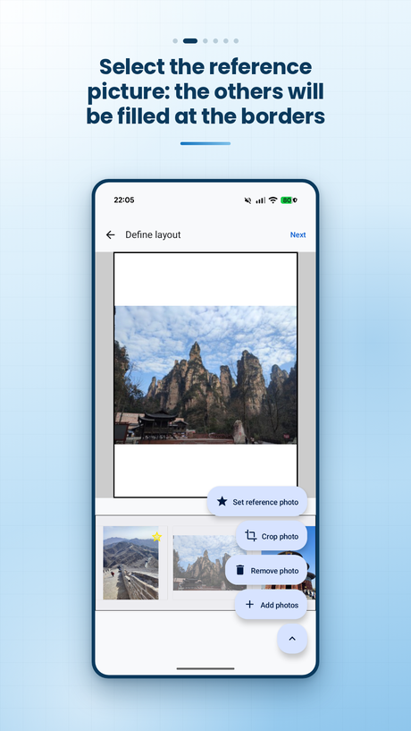
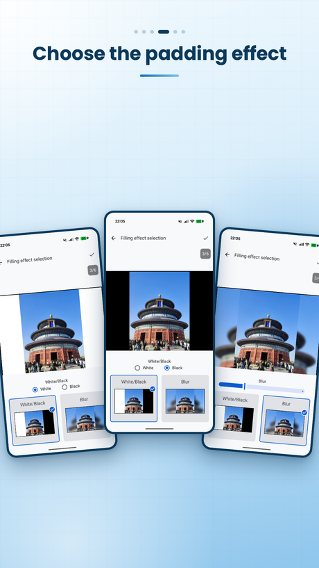
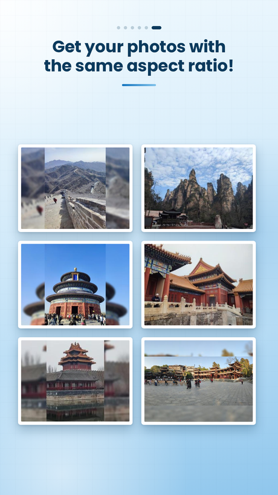

# Bordo

An Android app that gives every photo in an album the same aspect ratio without cropping any of them.

Photos taken at different moments may not have the same format: some are landscape, some portrait, or even a panorama. Printing them, posting them or collecting them into a single set usually means cropping, and cropping means throwing away part of the picture. Bordo takes the opposite approach: you pick one photo as the reference, and every other photo is padded at the borders until it matches that reference ratio. Nothing is cut away.

Everything runs on the device. The app declares no `INTERNET` permission, contains no analytics and no advertising, and requires no account.

## Screenshots

| Reference picture | Padding effect | Result |
| --- | --- | --- |
|  |  |  |

## Features

- **Reference picture.** Any photo in the album can be set as the one that dictates the aspect ratio, and it can be changed at any point before generating.
- **Two padding effects.** Solid colour, white or black, for a clean frame-style border; or a blur of the photo itself, with an adjustable radius, for padding that blends into the image.
- **Optional cropping.** Each photo can be cropped freely, or with the crop box locked to the reference picture's aspect ratio.
- **Persistent albums.** Albums are stored locally and can be reopened, renamed, extended with new photos or regenerated with a different effect.
- **Preview before export.** The composed album can be reviewed photo by photo before anything is written to storage.
- **Export to the gallery.** Generated images are written to the device's `Pictures` folder, with no watermark.

## How it works

The padding pipeline lives in [`utils/ImagePadding.kt`](app/src/main/java/com/steurendo/bordo/utils/ImagePadding.kt). For each photo:

1. The output canvas is derived from the reference picture's aspect ratio.
2. A background of that size is produced, either as a flat colour or by centre-cropping, scaling and blurring the photo itself.
3. The original photo is drawn centred on top of that background, unmodified.

The blur is computed with the RenderScript Intrinsics Replacement Toolkit rather than a Compose or Canvas effect, because the result has to be baked into the exported bitmap and not just rendered on screen.

## Tech stack

- Kotlin, targeting the JVM 17 toolchain
- Jetpack Compose with Material 3
- Navigation 3
- Hilt for dependency injection
- Room for local persistence
- Coil for image loading
- [RenderScript Intrinsics Replacement Toolkit](https://github.com/android/renderscript-intrinsics-replacement-toolkit) for the blur, vendored as the `:renderscript-toolkit` module

## Architecture

The app follows a three-layer separation, with a unidirectional data flow and one ViewModel per screen.

```
com.steurendo.bordo
├── app                 Application class
├── di                  Hilt modules
├── data                Room entities, DAOs, preferences, repository implementations, mappers
├── domain              Models, repository interfaces, use cases
│   └── usecases        album_management, albums, gallery, io
├── presentation
│   ├── navigation      Navigation 3 destinations
│   ├── theme           Material 3 theme
│   ├── common          Shared components, models and modules
│   └── ui              home, layoutdefinition, crop_photo, effectselection, preview, onboarding, intro
└── utils               Bitmap helpers, padding pipeline, logging
```


## Building

Requirements:
- Android Studio with JDK 17
- Android SDK with API 37 installed

## Permissions

| Permission | Why it is needed |
| --- | --- |
| `READ_MEDIA_IMAGES` (API 33+) | Read the photos the user picks for an album |
| `READ_EXTERNAL_STORAGE` (up to API 32) | The same, on older Android versions |
| `READ_MEDIA_VISUAL_USER_SELECTED` (API 34+) | Work with a user-selected subset of photos instead of the whole gallery |

There is no `INTERNET` permission, so the operating system prevents the app from making any network call. Photos, album metadata and generated images never leave the device. The full privacy policy is published [here](https://steurendo.github.io/BordoApp/).

## Localisation

The app ships with English as the default and a full Italian translation, in `res/values` and `res/values-it`.

## Third-party code

The `:renderscript-toolkit` module is the Android Open Source Project's RenderScript Intrinsics Replacement Toolkit, distributed under the Apache License 2.0. Its original copyright headers are preserved in the source files.

## License

The source code is published for reading and reference only, and default copyright applies: all rights are reserved by the author. If you would like to reuse any part of it, please open an issue or get in touch first.

## Contact

Stefano Agnetta — steurendoit@gmail.com